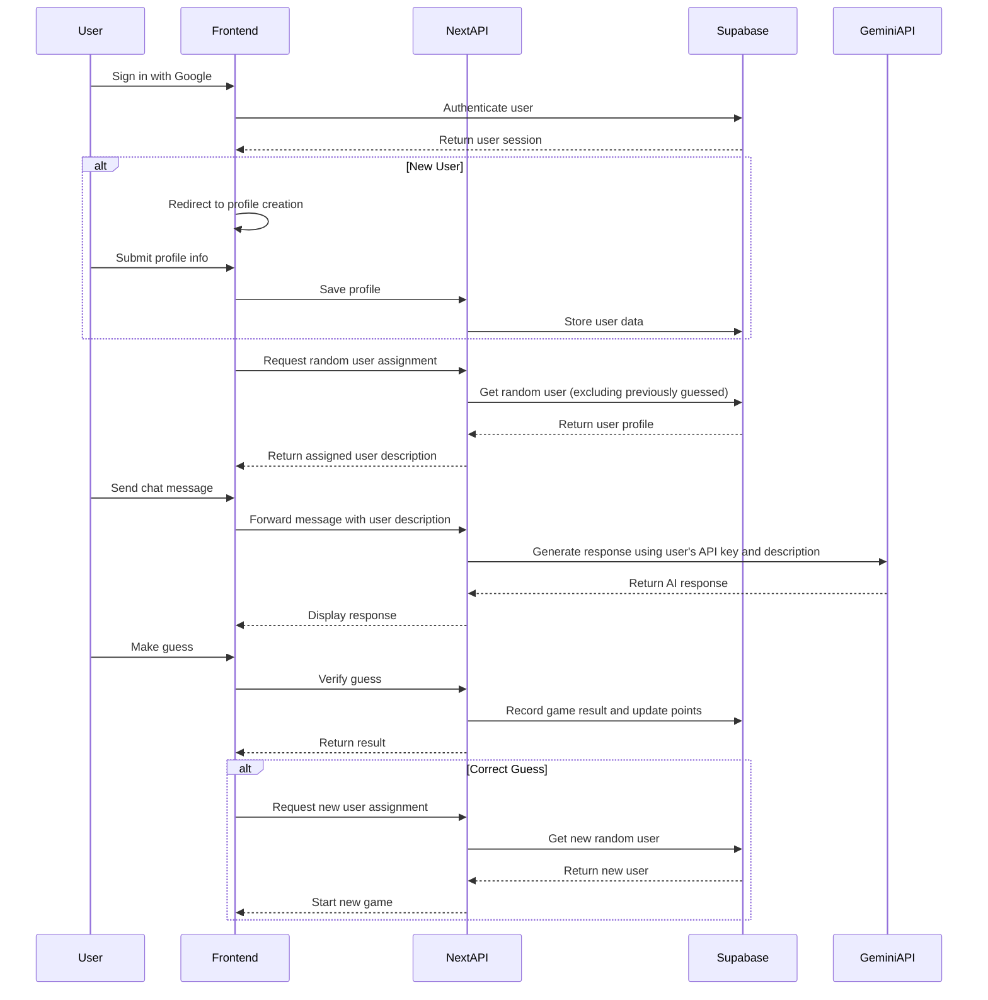
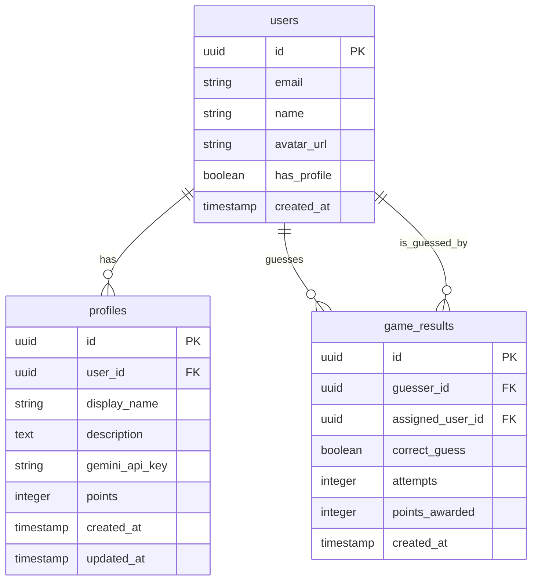

# Design Document: User Guessing Game

## Overview

The User Guessing Game is an interactive web application built on Next.js that allows users to create profiles and participate in a guessing game where they chat with an AI impersonating another user and try to guess their identity. The application uses Google authentication for user sign-in, Supabase for data storage, and the Gemini API for generating chat responses based on user descriptions.

## Architecture

The application follows a modern web architecture with the following components:

### Frontend
- Next.js 13+ with App Router for server and client components
- React for UI components
- Tailwind CSS for styling
- NextAuth.js integrated with Supabase Auth for authentication

### Backend
- Next.js API routes for server-side logic
- Supabase for database and authentication
- Gemini API integration for chat functionality

### Data Flow



## Components and Interfaces

### 1. Authentication Module

**Components:**
- SignInPage: Displays Google authentication option
- AuthCallback: Handles OAuth callback and session creation
- AuthProvider: Context provider for authentication state

**Interfaces:**
```typescript
interface User {
  id: string;
  email: string;
  name?: string;
  avatar_url?: string;
  has_profile: boolean;
}

interface Session {
  user: User;
  access_token: string;
  expires_at: number;
}
```

### 2. Profile Management Module

**Components:**
- ProfileCreationForm: Form for creating/editing user profiles
- ProfileWizard: Multi-step wizard for profile creation
- ProfileView: Display user profile information

**Interfaces:**
```typescript
interface UserProfile {
  id: string;
  user_id: string;
  display_name: string;
  description: string;
  gemini_api_key: string;
  points: number;
  created_at: string;
  updated_at: string;
}

interface ProfileQuestion {
  id: string;
  question: string;
  type: 'text' | 'dropdown';
  options?: string[];
  required: boolean;
}

interface ProfileFormData {
  display_name: string;
  college_name?: string;
  favourite_hobby?: string;
  favourite_dish?: string;
  favourite_sportsperson?: string;
  best_movie?: string;
  relationship_status?: 'Single' | 'Committed';
  additional_description?: string;
  gemini_api_key: string;
}
```

### 3. Game Management Module

**Components:**
- UserAssignment: Service for getting random users to guess
- GameHistory: Tracks game results and user interactions

**Interfaces:**
```typescript
interface GameResult {
  id: string;
  guesser_id: string;
  assigned_user_id: string;
  correct_guess: boolean;
  attempts: number;
  points_awarded: number;
  created_at: string;
}
```

### 4. Chat Interface Module

**Components:**
- ChatInterface: Main chat UI component
- MessageInput: Input for sending new messages
- GuessingInterface: UI for making guesses

**Interfaces:**
```typescript
interface ChatMessage {
  content: string;
  sender_type: 'user' | 'ai';
  timestamp: string;
}

interface ChatState {
  messages: ChatMessage[];
  assigned_user: {
    id: string;
    display_name: string;
    description: string;
  };
  attempts: number;
}
```

### 5. Gemini API Integration Module

**Components:**
- GeminiClient: Client for interacting with Gemini API
- PromptBuilder: Constructs prompts based on user descriptions
- ResponseProcessor: Processes and formats API responses

**Interfaces:**
```typescript
interface GeminiConfig {
  api_key: string;
  model: string;
  temperature: number;
  max_tokens: number;
}

interface GeminiPrompt {
  context: string;
  message: string;
  history: Message[];
}

interface GeminiResponse {
  content: string;
  finish_reason: string;
  usage: {
    prompt_tokens: number;
    completion_tokens: number;
    total_tokens: number;
  };
}
```

### 6. Dashboard Module

**Components:**
- UserDashboard: Main dashboard view
- StatsDisplay: Shows user statistics
- GameHistoryList: Lists past games and results

**Interfaces:**
```typescript
interface UserStats {
  total_points: number;
  successful_guesses: number;
  times_guessed: number;
  games_played: number;
}

interface GameHistoryItem {
  id: string;
  opponent_name: string;
  role: 'guesser' | 'guessed';
  result: 'success' | 'failure';
  points: number;
  date: string;
}
```

## Data Models

### Database Schema



### Supabase Tables

1. **users** (managed by Supabase Auth)
   - id (uuid, PK)
   - email (string)
   - name (string)
   - avatar_url (string)
   - has_profile (boolean)
   - created_at (timestamp)

2. **profiles**
   - id (uuid, PK)
   - user_id (uuid, FK to users.id)
   - display_name (string)
   - description (text) - Combined description from all questions and additional info
   - gemini_api_key (string, encrypted)
   - points (integer)
   - created_at (timestamp)
   - updated_at (timestamp)

3. **game_results**
   - id (uuid, PK)
   - guesser_id (uuid, FK to users.id)
   - assigned_user_id (uuid, FK to users.id)
   - correct_guess (boolean)
   - attempts (integer)
   - points_awarded (integer)
   - created_at (timestamp)

## Error Handling

### Authentication Errors
- Invalid credentials: Redirect to sign-in page with error message
- Session expiration: Automatic refresh or redirect to sign-in
- Missing profile: Redirect to profile creation

### Profile Creation Errors
- Validation errors: Display inline error messages
- Submission failures: Retry mechanism with exponential backoff
- API key validation: Verify Gemini API key before saving

### Game Assignment Errors
- No available users: Display message and retry later
- Assignment conflicts: Resolve by reassigning users
- Database errors: Implement retry logic with fallback options

### Chat Interface Errors
- API rate limiting: Implement queuing and retry mechanism
- Response generation failures: Display friendly error and retry option
- Connection issues: Automatic reconnection with state preservation

### Guessing Errors
- Invalid guesses: Clear feedback with remaining attempts
- System errors during verification: Preserve state and retry

## Testing Strategy

### Unit Testing
- Component tests for UI elements
- Service function tests for game logic
- API endpoint tests for data operations
- Authentication flow tests

### Integration Testing
- End-to-end user flows
- Database integration tests
- API integration tests
- Authentication integration with Supabase

### User Acceptance Testing
- Profile creation flow
- Game assignment and chat functionality
- Guessing mechanism
- Points system verification

### Performance Testing
- Chat response time optimization
- Database query performance
- API call efficiency
- Load testing for concurrent users

## Security Considerations

1. **Authentication Security**
   - Use Supabase Auth with secure JWT handling
   - Implement proper session management
   - Secure OAuth implementation

2. **Data Protection**
   - Encrypt sensitive data like Gemini API keys
   - Implement proper access controls
   - Regular security audits

3. **API Security**
   - Rate limiting for API endpoints
   - Input validation and sanitization
   - Secure handling of API keys

4. **Frontend Security**
   - CSRF protection
   - XSS prevention
   - Content Security Policy implementation

## Deployment Strategy

1. **Development Environment**
   - Local development with Supabase local emulator
   - Environment variable management for API keys

2. **Staging Environment**
   - Deployed to Vercel preview environments
   - Connected to Supabase staging project
   - Automated testing before promotion

3. **Production Environment**
   - Deployed to Vercel production
   - Connected to Supabase production project
   - Monitoring and alerting setup